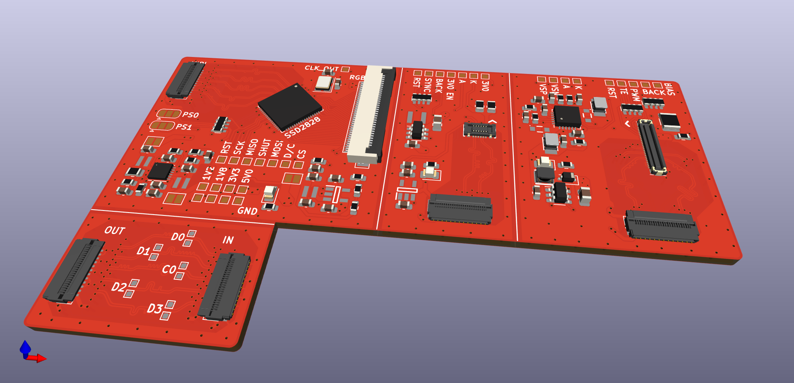
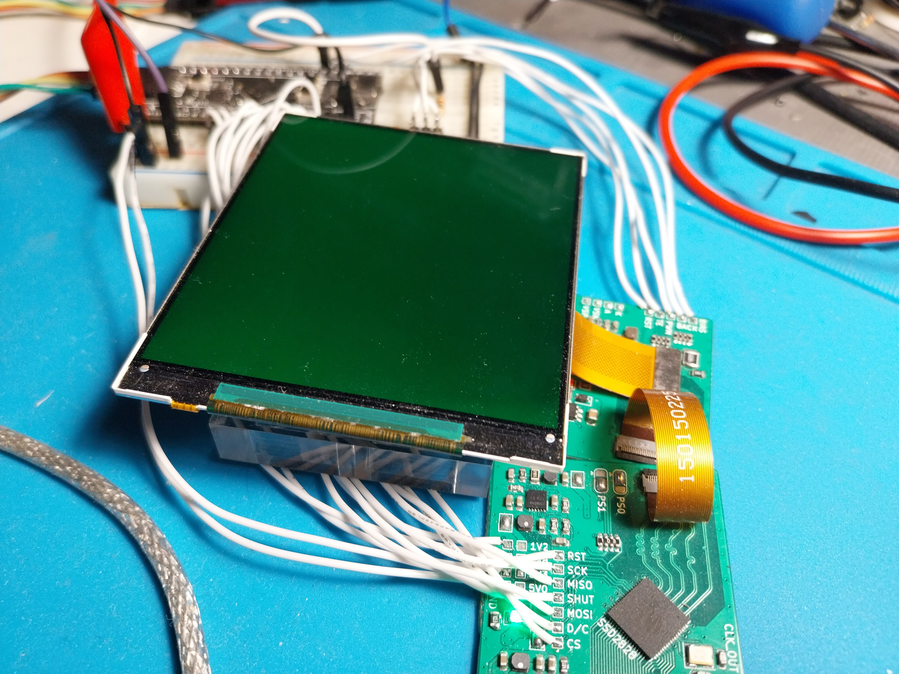

# SSD2828-DEV
A collection of boards to test the SSD2828 RGB to MIPI Converter with the LH154Q01 panel by AUO and the VS035ZSM by BOE. The boards are meant to be ordered as a single unit and then be separated using a box cutter ( the dust generated by cutting cutting FR4 is carcenogenic PLEASE be carefull! ).

  

# The pcb
The pcb is designed using the JLC04161H-7628 stackup by JLCPCB.  The MIPI DSI protool requires controlled impedance traces to function properly (100Ω differental, 50Ω single ended), depending on the provided pcb stackup different trace widths and spacings need to be selected. Additionally the signals must be kept away from noise sources such as inductors and other signals. When switching layers with MIPI signals, GND vias need to be placed near the signal vias.

# LH154Q01 panel
The LH154Q01 panel has been tested and is working correctly.

The panel does not support packed pixel stream packets, the only way to send pixel data to the display, is through DCS commands. in this demo, a STM32f401 is sending the the write_memory_continue(0x3C) DCS command containing pixel data, through SPI to the SSD2828. 

  

# VS035ZSM panel
The VS035ZSM panel has been tested and is working correctly.

The panel gets initialized on MIPI LP mode and the video is transmitted MIPI HS mode @912Mbps per lane. The ssd2828 is generating the test video signal called BIST. The panel has 8-bit color depth, reaning each pixel requires 24bits. The resolution of the panel is 1400x1600, including the porch values the total resoution is 1470 x 167. To operate at 60fps, 1470 x 1670 x 24 x 60 = 3.53Gbps are required resulting at 883Mbps per lane. The panel also suppors VESA DSC making 90fps operation possible. Unfortunately the SSD2828 does not include a DSC encoder. 

  

# Resources
### PCB
- [jlcpcb capabilities](https://jlcpcb.com/capabilities/pcb-capabilities).
- [jlcpcb impedance calculator](https://jlcpcb.com/pcb-impedance-calculator).
- [Jacinto 7 High-Speed Interface Layout Guidelines](https://www.ti.com/lit/an/spracp4/spracp4.pdf?ts=1708080453311&ref_url=https%253A%252F%252Fwww.google.com%252F).
- [MIPI DSI guidelines]( https://electronics.stackexchange.com/questions/610671/mipi-dsi-differential-pair-layout-guidance).
- [High-Speed PCB Design Tips - Phil's Lab](https://www.youtube.com/watch?v=VRJI0X-6yTg).
- [Differential Pairs - PCB Design Basics - Phil's Lab](https://www.youtube.com/watch?v=xwrdvhm4vgw).

### SSD2828
- [SSD2828 RGB转MIPI转换板制作（1)](https://blog.csdn.net/weixin_37214729/article/details/123339267).
- [SSD2828 RGB转MIPI转换板制作（2)](https://blog.csdn.net/weixin_37214729/article/details/127710648).
- [SSD2828调试记录](https://blog.csdn.net/luoqindong/article/details/39349333).
- [project-display](https://github.com/jlywxy/project-display).
- [Index of /lcd/ssd2828/](http://www.internetsomething.com/lcd/ssd2828/).

### LH154Q01
- [Driving IPOD Nano 6 MIPI LCD Using FPGA](https://www.circuitvalley.com/2020/01spi-mipi-bridge-fpga-verilog-hdl-ipod-nano-nano-lcd-iphone-mipi-lcd.html).
- [SSD2805 w/ LH154Q01](https://github.com/techtoys/SSD2805/blob/master/Microchip/Graphics/Drivers/SSD2805.c).
### VS035ZSM
- [Project North Star](https://github.com/leapmotion/ProjectNorthStar).

